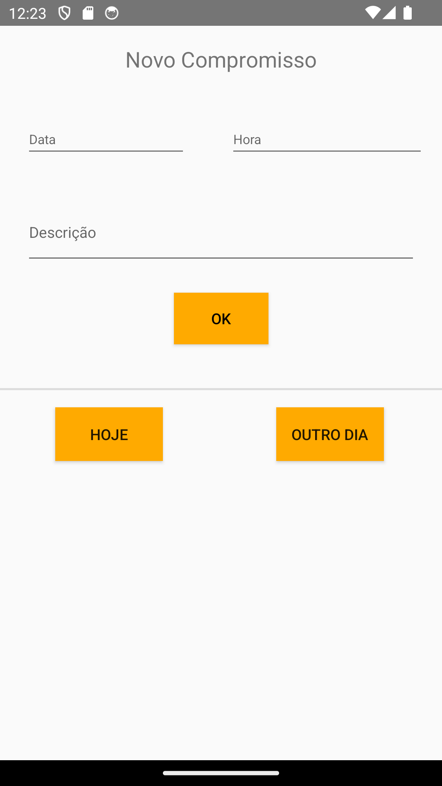

# Minhagenda
> Trabalho que está sendo desenvolvido, para a matéria de Engenharia de Aplicações Móveis, pelos alunos: 
> - João Nogueira
> - Kaio Prandini
> - Luis Eduardo
> - Matheus Oliveira 

Consiste em uma agenda digital, que está sendo utilizada para aprendermos a trabalhar com aplicações Android nativas, com Fragments, acesso a banco de dados (futuramente) e também aos conceitos de MVC.

<table>
    <tr>
        <td>Tela principal</td>
        <td>Demonstração</td>
    </tr>
    <tr>
        <td></td>
        <td></td>
    </tr>   
</table>